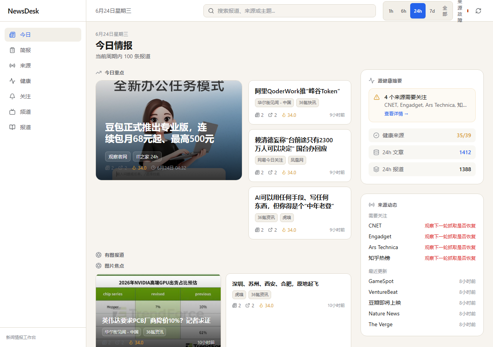

# NewsDesk MVP

个人新闻情报聚合看板的最小可用版本（MVP）。从多个 RSS/API 来源自动抓取新闻，按标题相似度与 URL 去重聚合成 **Story（事件）**，并在 React 看板中以 Focus / Visual / Text / Rising 等视图呈现。Windows 桌面端基于 Tauri 2 封装，支持系统托盘、后台驻留与一键抓取。



> 🌐 **在线展示页**：https://wjt0321.github.io/newsdesk-mvp  
> ⬇️ **下载最新 Windows 安装包**：<a href="https://github.com/wjt0321/newsdesk-mvp/raw/main/frontend/src-tauri/target/release/bundle/nsis/NewsDesk_0.1.0_x64-setup.exe" download>NewsDesk_0.1.0_x64-setup.exe</a>

---

## 功能特性

- **来源管理**：增删改查 RSS/API 来源，支持启用/禁用、抓取间隔、暂停/恢复；来源详情页展示最近文章、进入的报道与抓取记录。
- **自动抓取**：APScheduler 每分钟检查启用来源并按 `fetch_interval_minutes` 触发抓取。
- **去重聚类**：
  - 硬去重：`canonical_url` / `hash_url` / `hash_title` 相同即合并。
  - 相似度聚类：`rapidfuzz` 标题相似度 ≥ 85 且在 48h 窗口内合并为 Story。
  - 跨语言聚类（MVP+）：中英文实体关键词（如 NVIDIA/英伟达、AI/人工智能）映射到统一 canonical key，作为相似度辅助信号。
- **Story 动态评分**：根据来源数、文章数、更新时间计算 `heat_score` 与状态（new / developing / stable）。
- **频道与关注**：内置 9 个频道（科技、全球、财经、游戏、科学、体育、娱乐、政治、生活）；关注规则通过关键词命中 Story。
- **AI 摘要（可选基础设施）**：已预留 OpenAI-compatible provider、缓存、限额与失败降级链路；默认关闭。未配置 API Key 时使用 placeholder，不代表真实摘要质量已验证。
- **今日简报**：`GET /api/briefing` 聚合过去 24 小时高热度 Story，前端 `/briefing` 页面支持一键复制纯文本。
- **多源差异**：`GET /api/stories/{id}/diff` 对比同一 Story 下不同来源的报道标题与摘要，StoryDrawer 中直接展示。
- **内容清洗与全文搜索**：自动清洗标题、摘要和正文；前端支持按报道、来源、主题实时搜索（`/api/stories?q=`、`/api/articles?q=`）。
- **来源与文章详情**：来源 chip 可点击进入 SourceDetail；StoryDrawer 中的文章列表可在应用内打开 ArticleDrawer 阅读。
- **分区首页**：今日重点 / 有图报道 / 正在升温 / 文字情报，右侧显示来源健康摘要与来源动态。
- **桌面壳**：Tauri v2 + Rust，系统托盘、启动/停止 Python backend sidecar、最小化到托盘。

---

## 技术栈

| 层 | 技术 |
|---|---|
| 后端 | Python 3.10+、FastAPI、SQLAlchemy 2.0、SQLite、APScheduler |
| 前端 | Vite、React 19、TypeScript、Tailwind CSS、TanStack Query |
| 桌面 | Tauri v2、Rust 1.77+ |

---

## 目录结构

```
newsdesk-mvp/
├── backend/                 # FastAPI 后端
│   ├── app/
│   │   ├── main.py          # FastAPI 入口与 lifespan
│   │   ├── models.py        # SQLAlchemy 模型
│   │   ├── schemas.py       # Pydantic 模型
│   │   ├── routers/         # API 路由
│   │   ├── services/        # 业务逻辑（抓取、聚类、序列化、调度）
│   │   ├── utils/time.py    # UTC 时间工具（处理 SQLite naive datetime）
│   │   └── seed.py          # 默认来源种子
│   ├── scripts/             # 源验证、导入、构建 sidecar 等工具脚本
│   ├── tests/               # pytest 测试
│   └── pyproject.toml
├── frontend/                # React 前端
│   ├── src/
│   │   ├── api/             # axios API 客户端
│   │   ├── components/      # 通用组件
│   │   ├── pages/           # 页面
│   │   └── App.tsx
│   ├── src-tauri/           # Tauri Rust 项目
│   └── package.json
└── scripts/
    └── smoke_test.py        # 后端烟测脚本
```

---

## 快速开始

### 1. 克隆与进入目录

```bash
cd newsdesk-mvp
```

### 2. 启动后端

```bash
cd backend
python -m venv .venv
.venv/Scripts/python -m pip install -e ".[test]"
.venv/Scripts/python -m uvicorn app.main:app --host 127.0.0.1 --port 8000
```

后端默认使用 `backend/data/newsdesk.db`（SQLite）。首次启动会自动建表并写入 5 条示例来源。

### 真实源集合与饱和测试

项目维护一份经过验证的真实订阅源清单，用于 dogfood 和饱和测试：

- `real-sources-v2.md`：39 个验证可用的 RSS / RSSHub 源，覆盖国内时政/财经/科技/AI、国际综合/科技/AI、游戏、科学、视频文化。
- `real-sources-v1.md`：旧版清单（已有多数源失效，仅保留记录）。

一键导入并抓取全部 v2 源：

```bash
cd backend
.venv/Scripts/python scripts/import_curated_sources.py --clear
```

该脚本会清空现有 sources / articles / stories / fetch_logs，写入 39 个源并执行一轮抓取。最近一次运行的结果：39/39 源成功，新增 1134 篇文章，其中 59.3% 携带封面图片，Today 首页 Hero / Visual 卡片可正常显示图片。

### AI 摘要（可选增强能力）

AI 摘要为可选增强能力。当前已预留 OpenAI-compatible provider、缓存、限额与失败降级链路；默认关闭。未配置 API Key 时会使用 placeholder，不代表真实摘要质量已验证。

在 `backend/.env` 中配置：

```env
AI_ENABLED=true
AI_PROVIDER=deepseek          # openai | deepseek | doubao | placeholder
AI_MODEL=deepseek-chat
AI_BASE_URL=https://api.deepseek.com/v1
AI_API_KEY=sk-xxxxxxxx
AI_DAILY_LIMIT=50
AI_TEMPERATURE=0.7
AI_MAX_TOKENS=512
```

- `AI_ENABLED=false` 是默认状态，此时完全不生成 AI 摘要。
- 未配置 `AI_API_KEY` 或提供者不可用时，自动回退到 `placeholder`。
- 仅对高置信 Story 调用；API 失败时静默降级，不阻塞基础看板。

### 3. 启动前端开发服务器

```bash
cd frontend
npm install
npm run dev
```

打开 http://localhost:5173 即可使用。

---

## 测试

### 后端单元测试

```bash
cd backend
.venv/Scripts/python -m pytest -q
```

当前覆盖：模型、来源 CRUD、系统暂停/恢复、抓取、Story 聚类、频道、关注规则、调度器。

### 后端烟测

```bash
cd newsdesk-mvp
backend/.venv/Scripts/python scripts/smoke_test.py
```

会真实启动后端，依次检查 system / sources / pause / resume / fetch / fetch-logs / stories / channels / watch-rules，然后关闭进程。

### 前端 Lint

```bash
cd frontend
npm run lint
```

### 前端构建

```bash
cd frontend
npm run build
```

### 桌面端构建（Windows NSIS 安装包）

> ⚠️ 不要单独运行 `cargo build --release`。Tauri 桌面端必须通过 `npm run tauri:build` 构建，才能正确把前端 `dist/` 资源打包进可执行文件；否则运行时窗口会尝试连接开发服务器 `localhost:5173`，出现 “localhost 拒绝连接”。

**开发模式**：Tauri 会优先寻找 `frontend/src-tauri/sidecars/newsdesk-backend-x86_64-pc-windows-msvc.exe`；找不到（或 sidecar 为空/无效）时回退到 `backend/start_backend.bat`。开发模式要求项目源码和 `backend/.venv` 保留在原位。

**生产模式（打包 backend 为独立 sidecar exe）**：

```bash
cd newsdesk-mvp
backend/.venv/Scripts/python scripts/build_backend_exe.py
cd frontend
npm run tauri:build
```

`scripts/build_backend_exe.py` 会调用 PyInstaller 生成独立可执行文件，并自动复制到 `frontend/src-tauri/sidecars/`。构建完成后：

- 可直接运行的二进制：`frontend/src-tauri/target/release/newsdesk.exe`
- 可分发的安装包：`frontend/src-tauri/target/release/bundle/nsis/NewsDesk_0.1.0_x64-setup.exe`

---

## 主要 API

| 方法 | 路径 | 说明 |
|---|---|---|
| GET | `/api/system/status` | 系统暂停状态 |
| POST | `/api/system/pause` | 暂停抓取并保存手动启用的来源 |
| POST | `/api/system/resume` | 恢复抓取并还原手动启用的来源 |
| GET | `/api/sources` | 列出来源 |
| POST | `/api/sources` | 创建来源 |
| POST | `/api/sources/{id}/fetch` | 手动触发抓取 |
| GET | `/api/articles` | 文章列表 |
| GET | `/api/stories` | Story 列表 |
| GET | `/api/stories/{id}/diff` | 多源差异 |
| GET | `/api/channels` | 频道列表 |
| GET/POST/PATCH/DELETE | `/api/watch-rules` | 关注规则 CRUD |
| GET | `/api/briefing` | 今日简报 |
| GET | `/api/fetch-logs` | 抓取日志 |

---

## 代码审核与已修复的软件缺陷

本次审核重点关注运行时错误、逻辑错误与不一致性，主要修复项如下：

### 后端

1. **级联删除**：为 `Source`、`Article`、`FetchLog`、`Story`、`StoryArticleLink` 补充 `ondelete="CASCADE"` 与 relationship 级联配置；启用 SQLite `PRAGMA foreign_keys=ON`，删除来源时同步清理其文章与抓取日志。
2. **抓取异常路径**：`fetch_source` 异常处理中移除对已经 attached 对象的重复 `db.add()`，避免 SQLAlchemy 状态错误。
3. **空标题文章**：`fetch_source` 跳过无标题条目，避免产生无法归属 Story 的孤儿文章。
4. **去重日期兜底**：标题 hash 去重时，对没有 `published_at` 的文章使用 `fetched_at` 作为 48h 窗口兜底。
5. **时区安全的数据库查询**：所有 `since` 时间窗口统一使用 `naive_utc_now()` 与 naive 列比较，避免 aware/naive 混用。
6. **Story 列表分页**：改为在数据库层按 `heat_score` / `last_updated_at` 排序并 limit/offset，避免数据量大时全表加载导致 OOM。
7. **暂停状态一致性**：手动触发 `POST /api/sources/{id}/fetch` 时若系统处于暂停状态，返回 `409 Conflict`。
8. **频道关键词误匹配**：英文关键词使用整词匹配（`\b`），避免 `us` 匹配 `customer`、`market` 匹配 `supermarket`。
9. **日期解析兜底**：`normalizer.py` 在字符串日期缺失时，使用 feedparser 提供的 `published_parsed` / `updated_parsed` 元组。
10. **Pydantic 配置**：将 `class Config` 改为 `SettingsConfigDict`，消除 v3 弃用警告。
11. **Story 状态**：`story_status()` 增加 `breaking`（30 分钟内首次出现）和 `hot`（heat_score >= 50），让前端 `StoryCard` 中的红底/琥珀底状态分支生效。
12. **WatchRule 匹配阈值**：`matching_stories_for_rule()` 将关键词匹配下推到 SQL 层（`LIKE` OR 拼接），避免冷门关键词被 `limit * 3` 硬上限截断而永远返回空。
13. **抓取异常注释**：在 `fetch_source` except 块补充注释，说明 `log` 已在开头提交、异常路径仅更新状态的意图。
14. **订阅源治理与图片修复**：替换旧版失效源为 39 个验证可用的 RSS/RSSHub 源（含凤凰网）；为 `fetcher.py` 增加 `Accept-Encoding: gzip, deflate`，修复部分 feed 的 brotli 解码错误；Today 首页重新出现封面图片。

### 前端

1. **Watchlist 切换规则后刷新命中故事**：`toggleMutation` 成功后同时使 `watch-rules` 与 `watch-rules/{id}/stories` 查询失效。
2. **来源分类编辑重复提交**：`onBlur` 提交前检查 `categoryMutation.isPending`，防止按 Enter 时触发两次 PATCH。
3. **相对时间格式化**：`formatRelativeTime` 支持未来时间显示，并处理无效日期。
4. **来源表单布局**：`SourcesPage` 将 7 个字段改为两行布局，并把 Language / Region 收进可折叠的“Advanced options”，减少窄屏换行混乱。
5. **前端 README**：替换 Vite 模板说明，补充 NewsDesk 前端专用的技术栈、目录、命令和路由说明。
6. **UI 视觉改造**：将 Today、Source Health、StoryDrawer、Briefing 等页面从“后台管理系统”风格升级为“Editorial Intelligence Desk”新闻情报工作台；新增 HeroStory、SecondaryStory、SignalBadge、SourceChips 等可复用组件；界面全部中文化；Toaster 改到底部避免遮挡阅读区。

### Tauri / 桌面壳

1. **后端启动等待**：`start_backend` 启动 sidecar 后会轮询端口，最多等待 30 秒，未就绪则报错。
2. **进程树清理**：Windows 下使用 `taskkill /T /F /PID` 结束 backend 进程树，关闭应用时不再遗留 `uvicorn`。
3. **路径查找**：`find_backend_dir` 增加相对项目根与可执行文件目录的候选路径，覆盖开发 `tauri dev` 与打包后的常见布局。
4. **路径空格**：启动 `start_backend.bat` 时对脚本路径加引号。
5. **异步托盘命令**：`toggle_fetching` 改为 `async` + `reqwest` 异步，避免阻塞主线程。
6. **通知权限**：在 `default.json` 中补充 `notification:default`。

---

## 已知限制

- **订阅源依赖网络环境**：`real-sources-v2.md` 中部分 RSSHub 路由和海外官方 RSS 在当前网络环境下可能返回 503 或超时。如果大量源失败，可自建 RSSHub 实例或替换为本地可访问的源。
- **Tauri 生产包**：需要先用 `scripts/build_backend_exe.py` 生成 sidecar，再运行 `npm run tauri:build`。开发模式下若未生成 sidecar，会回退到 `backend/start_backend.bat`。
- **桌面端后端路径**：如果用户从非常规目录启动 `newsdesk.exe` 且 sidecar/backend 不在相对路径中，可能无法自动启动后端。
- **Story 热度排序**：数据库排序使用上一次文章变更时写入的 `heat_score` 列；动态时间衰减在返回页面前重新计算，因此排序是大致热度而非实时精确热度。
- **AI 摘要**：已预留 provider 链路但真实 API 摘要质量、成本、限额尚未完成 dogfood 验证；默认关闭。
- **SQLite 外键**：生产迁移到 PostgreSQL 后请移除 `PRAGMA foreign_keys` 相关代码，直接使用 `DateTime(timezone=True)`。
- **实体识别**：当前使用关键词与正则规则提取实体；中文人名/机构名等细粒度实体需要后续接入 NER。

---

## 注意事项

- **时区处理**：SQLite 的 `DateTime` 列不保存时区，从数据库读取的是 naive datetime。统一使用 `app.utils.time.ensure_utc()` 将其视为 UTC 后再计算。
- **网络依赖**：`/api/sources/{id}/fetch` 需要能访问外部 RSS 源；内网或无法访问外网时可能返回 `failed` 日志，但 API 仍返回 200。系统处于暂停状态时会返回 409。
- **测试隔离**：`tests/conftest.py` 将 `TESTING=1` 并替换为内存 SQLite，且启用外键，避免影响真实数据库。
- **CORS**：MVP 阶段允许 `*` 来源，生产环境请按需求收紧。

---

## 开源致谢

NewsDesk MVP 基于多个优秀开源项目构建，包括 FastAPI、SQLAlchemy、feedparser、RapidFuzz、React、Vite、Tailwind CSS、TanStack Query 和 Tauri 等。详见 `NOTICE.md`。第三方项目、新闻源、商标与内容版权归各自权利人所有。

---

## 后续可扩展方向

- 将 SQLite 替换为 PostgreSQL，使用 `DateTime(timezone=True)` 彻底消除时区问题。
- 在真实 API Key 配置下 dogfood 验证 AI 摘要质量、成本与限额。
- 用户登录与跨设备同步关注规则。
- 支持更多抓取协议（Atom、JSON Feed、网页抓取）。
